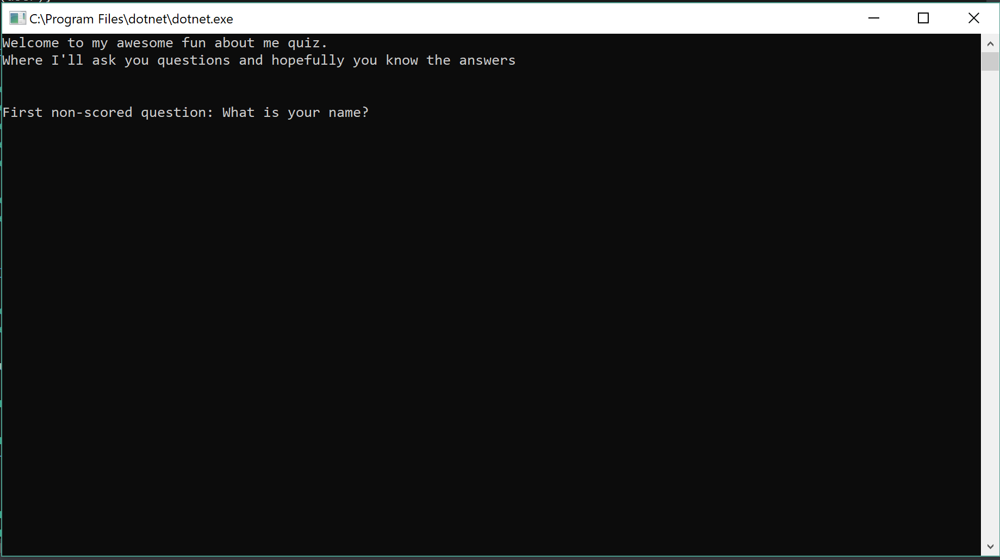

# lab-01-about-me-quiz

This is an About-Me Quiz built in C# using the Visual Studio IDE. This is to solidify working with C# as a language and getting familiar with the environment. There are a total of 5 questions that the user will experience that explains a little bit more about myself.
***
## Getting Started
* Download the Lab-01-About-Me
* After it's been downloaded, navigate to the .csproject file and open up Visual Studio. It is built using the latest .NET 2.1 SDK
* Once the project is opened, run it with or without debug and a console should appear. If the below image is what you are greeted with then success! You can now take the quiz
***
## What it should look like

***